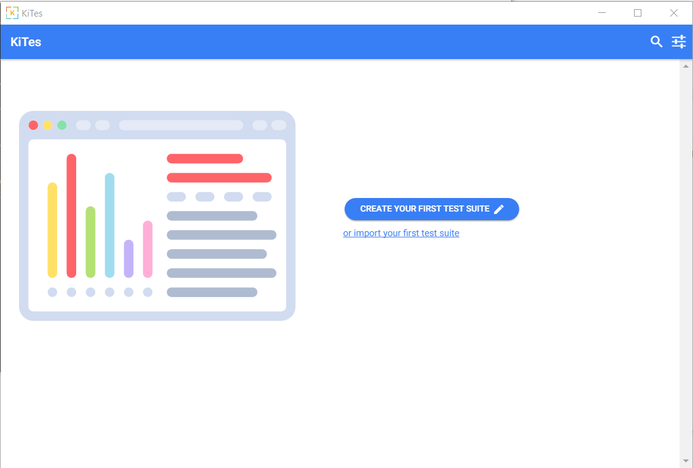

<div id="top"></div>

<!-- PROJECT SHIELDS -->
<!--
*** I'm using markdown "reference style" links for readability.
*** Reference links are enclosed in brackets [ ] instead of parentheses ( ).
*** See the bottom of this document for the declaration of the reference variables
*** for contributors-url, forks-url, etc. This is an optional, concise syntax you may use.
*** https://www.markdownguide.org/basic-syntax/#reference-style-links
-->

[](https://opensource.org/licenses/Apache-2.0)

<!-- PROJECT LOGO -->
<br />
<div align="center">
  <a href="https://github.com/pragma81/kites">
    
  </a>

<h3 align="center">KITes</h3>

  <p align="center">
    KITes (Keep It Testable) is an intelligent gherkin file editor which integrates with your preferred test case management tool (Zephyr JIRA plug-in is supported). Business analysts, software and test engineers use Kites to edit, share feature files written in natural language and synch them with generated acceptance test script using tools like cucumber.
  </p>
    <p align="center">
    Most of this work is inspired by <a href="https://opensource.com/article/18/11/continuous-testing-wrong"> this </a> opensource.com community article.
    <br />
    <br />
    
  </p>
</div>

## Built With

* [Angular](https://angular.io/)
* [Electron](https://www.electronjs.org/)
* [Ionic Framework](https://ionicframework.com/)
* [Typescript](https://www.typescriptlang.org/)
* [Browserify](https://browserify.org/)
* [PouchDB](https://pouchdb.com/)


<!-- Features -->
## Features

### Test suite dashboard with search and automated scripts report

![Test suite dashboard][dashboard]
  
### Gherkin editor with intellisense and inline error highlighting

![Editor][editor]

### Import local feature files folders
![Import][import]

### Synchronize with Jira
![Synchronize][Synchronize]


<!-- GETTING STARTED -->
## Getting Started


### Prerequisites

1. Install Node Manager
   - [Windows] Install nvm downloading from [here](https://github.com/coreybutler/nvm-windows).
   - [MacOs] Install nvm using homebrew and run ```brew install nvm ``` . Use this [link](https://tecadmin.net/install-nvm-macos-with-homebrew/) to setup nvm.

2. Install Nodejs
    - Use a shell or prompt (with administrator privilegies) and run ```sh nvm install v6.14.3```

3. Install ionic2 cli
    - Use a shell or prompt (with administrator privilegies) and run ```sh npm install -g ionic@2.0.0-beta.32```

### Installation and Development

1. Clone the repo
   ```sh
   git clone https://github.com/pragma81/kites
   ```
3. Install NPM packages
   ```sh
   npm install
   ```
4. Development test with live reload from localhost:8100
   ```sh
   ionic serve
   ```
5. Build for specific platform
    - Windows
    ```sh
    npm start app-win 
    ```
    - MacOs
    ```sh
    npm start app-mac
    ```


<!-- CONTRIBUTING -->
## Contributing

Contributions are what make the open source community such an amazing place to learn, inspire, and create. Any contributions you make are **greatly appreciated**.

If you have a suggestion that would make this better, please fork the repo and create a pull request. You can also simply open an issue with the tag "enhancement". If you want to contribute the roadmap (see below) use the tag "feature".
Don't forget to give the project a star! Thanks again!

1. Fork the Project
2. Create your Feature Branch (`git checkout -b feature/AmazingFeature`)
3. Commit your Changes (`git commit -m 'Add some AmazingFeature'`)
4. Push to the Branch (`git push origin feature/AmazingFeature`)
5. Open a Pull Request

<!-- ROADMAP -->
## Roadmap

- Upgrade to third parties libraries LT versions
    - Ionic v5
    - Angular v8 (constrained by Ionic version)
    - Electron v15 (node version upgrade will be required as well) 
- Support Jira 7.x
- Support Azure Test Plans
- Enable spelling check within feature editor
- Test steps dictionary available within intellisense


<!-- LICENSE -->
## License

Distributed under the Apache v2.0 License. See `LICENSE.txt` for more information.


<!-- MARKDOWN LINKS & IMAGES -->
<!-- https://www.markdownguide.org/basic-syntax/#reference-style-links -->
[contributors-shield]: https://img.shields.io/github/contributors/github_username/repo_name.svg?style=for-the-badge
[contributors-url]: https://github.com/github_username/repo_name/graphs/contributors
[forks-shield]: https://img.shields.io/github/forks/github_username/repo_name.svg?style=for-the-badge
[forks-url]: https://github.com/github_username/repo_name/network/members
[stars-shield]: https://img.shields.io/github/stars/github_username/repo_name.svg?style=for-the-badge
[stars-url]: https://github.com/github_username/repo_name/stargazers
[issues-shield]: https://img.shields.io/github/issues/github_username/repo_name.svg?style=for-the-badge
[issues-url]: https://github.com/github_username/repo_name/issues
[license-shield]: https://img.shields.io/github/license/github_username/repo_name.svg?style=for-the-badge
[license-url]: https://github.com/github_username/repo_name/blob/master/LICENSE.txt
[linkedin-shield]: https://img.shields.io/badge/-LinkedIn-black.svg?style=for-the-badge&logo=linkedin&colorB=555
[linkedin-url]: https://linkedin.com/in/linkedin_username
[dashboard]: images/dashboard.png
[editor]: images/editor.png
[import]: images/import.png
[synchronize]: images/synchronize.png
